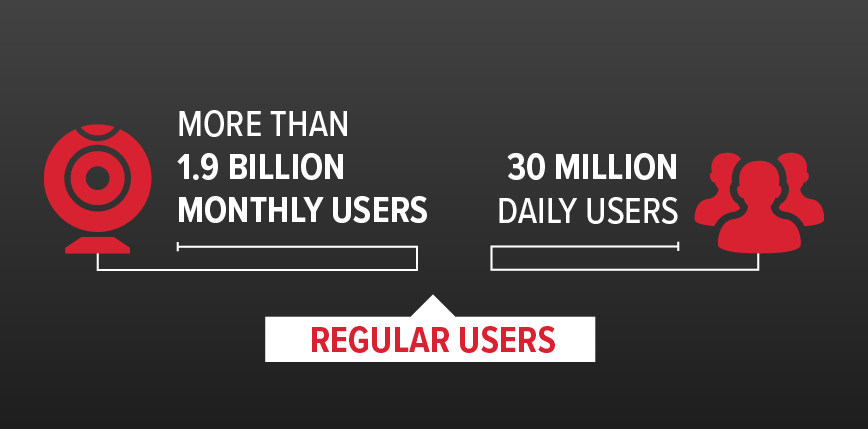
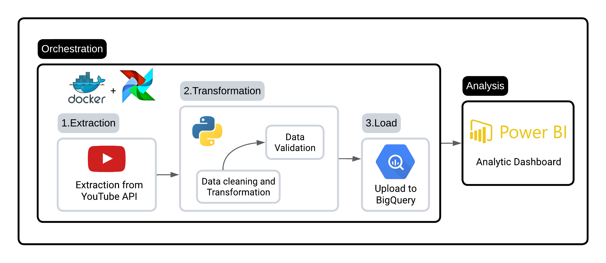

# YouTube API ETL Pipeline using Airflow

## Table of Contents

- [Project Overview](#project-overview)
  - [Why YouTube API?](#why-youtube-api)
- [Flow Chart](#flow-chart)
- [Airflow DAG Overview](#airflow-dag-overview)
  - [1. Extract and Transform Task](#1-extract-and-transform-task)
  - [2. Data Validation Task](#2-data-validation-task)
  - [3. Export to BigQuery Task](#3-export-to-bigquery-task)
- [DAG Configuration Highlights](#dag-configuration-highlights)
- [Task Dependencies](#task-dependencies)
- [Notes](#notes)
- [Power BI Dashboard](#power-bi-dashboard)

## Project Overview

This project showcases an ETL (Extract, Transform, Load) pipeline orchestrated using Apache Airflow and integrated with the YouTube API. The pipeline efficiently extracts, transforms, and loads data from the YouTube API to Google BigQuery, laying the groundwork for insightful analytics. The analytical component of the project will be facilitated using Power BI.

### Why YouTube API?

The YouTube API serves as the core of this project due to its real-time data access, spanning a wide range of content, channel metrics, comments, and more, enabling comprehensive analysis.

## Flow Chart

## Airflow DAG Overview

The Airflow Directed Acyclic Graph (DAG) orchestrates the ETL pipeline, encompassing these essential tasks:

### 1. Extract and Transform Task

This task retrieves data from the YouTube API using an API key and performs initial data transformations. The `youtube_statistics` endpoint is utilized for efficient data analysis.

### 2. Data Validation Task

Extracted data is subjected to rigorous validation, ensuring its accuracy, integrity, and adherence to predefined data structures.

### 3. Export to BigQuery Task

Validated data is loaded into Google BigQuery for further processing and advanced analysis. The task employs the `google.cloud` library, necessitating the correct credentials.

## DAG Configuration Highlights

- Default Arguments: The DAG incorporates default settings for task retries, email notifications, and scheduling.
- Scheduling: The DAG is scheduled to run at specific intervals (6:00 AM, 12:00 PM, and 6:00 PM) using a cron expression (0 6,12,18 * * *).
- Error Handling: Email notifications are triggered upon task failure to provide stakeholders with pipeline status updates.

## Task Dependencies

Tasks within the DAG are sequenced using the "bitwise left shift" (>>) operator, ensuring logical execution. The `extract_and_transform_task` precedes `data_validation_task`, followed by `export_to_bigquery_task`.

## Notes

- Ensure proper configuration of API keys, credentials, and libraries (`youtube_statistics`, `google.cloud`).
- Stay vigilant regarding API terms, data schemas, or access permissions changes that could impact pipeline functionality.

## Power BI Dashboard

Please note that the Power BI dashboard is under development, with ongoing updates to enhance visualizations and functionality.

---

Feel free to adapt and tailor this content to suit the specifics of your project and DAG setup.
